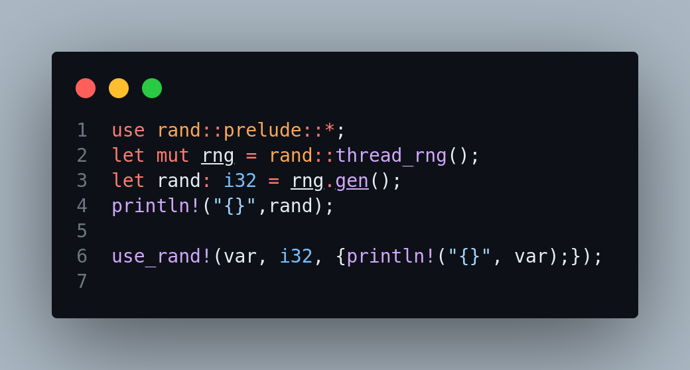
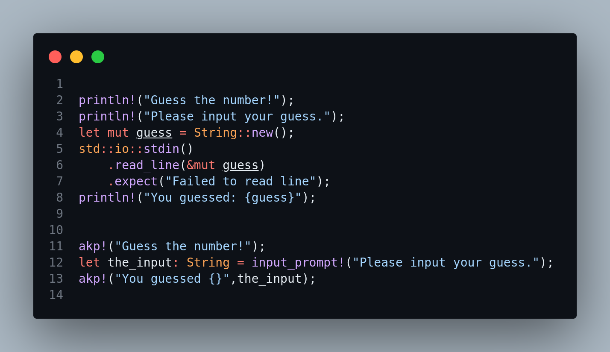

# AK-Macros

# Description

AK-Macros is: Rust library To speed up the development process and make it easy AK-Macros It is a group of the most popular and frequently used macros 

# Features

Provides a collection of macros for common programming tasks.
Demonstrates how macros can improve code readability and maintainability.
Offers examples and usage instructions to help developers leverage macros effectively.
How AK-Macros Help Developers
AK-Macros offers several benefits to Rust developers:

Code Reusability: AK-Macros provides reusable code patterns that can be used across projects, reducing duplication and promoting cleaner, more maintainable codebases.
Metaprogramming: Developers can use AK-Macros to generate code at compile time based on certain patterns or conditions, reducing boilerplate code and making the codebase more expressive.
Domain-Specific Languages (DSLs): With AK-Macros, developers can create domain-specific languages within Rust, tailored to specific problem domains, leading to more intuitive and concise code.
Error Handling: AK-Macros offers custom error handling macros that abstract away common error-handling patterns, resulting in more readable and consistent error-handling code.
Performance Optimization: AK-Macros can be used to optimize performance-critical code by generating specialized code tailored to specific use cases, leading to more efficient code execution.

# Usage

```rust

// Import the macros library File
use ak_macros::*;
fn main() {
    let my_name = "hamdy";
    akp!("My Name:{}",my_name);
}
```

### Usage>>

<span style="color:green;"><strong>You can delete All dependencies and install it if you need it for best performance</strong></span>

# simple App with Ak-Macros

```rust
use ak_macros::*;
fn main() {

    akp!("hello world");

    let my_name = input_prompt!("Enter the Name for Best crate. ?");

    if_cond!(
        my_name,
        my_name == "ak-macros",
        akp!("hello devs. ak-macros make rust be a simple"),
        akp!("Take your time I m sure you will fall in love AK-Macros")
    )
}
```

# Rust Code Vs Ak-Macros



